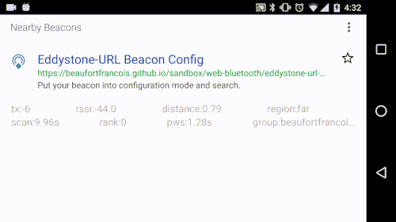

# Eddystone Web Bluetooth

> Web Bluetooth Eddystone made easier

[](https://travis-ci.org/zurfyx/eddystone-web-bluetooth)
[](https://david-dm.org/zurfyx/eddystone-web-bluetooth)
[](https://david-dm.org/zurfyx/eddystone-web-bluetooth#info=devDependencies)
[](https://codeclimate.com/github/zurfyx/eddystone-web-bluetooth)

<p align="center">
  <br />
  <a href="#getting-started">Getting started source-code</a> using <a href="https://twitter.com/ThePhysicalWeb/status/770262699766755329">Physical Web beacons</a>
</p>

## Features

- [x] Scan Eddystone beacons
- [x] Connect / Disconnect
- [x] Monitor connection status
- [ ] Read Capabilities
- [ ] Read / Write Active Slot
- [x] Read / Write Advertising Interval
- [x] Read / Write Radio Tx Power
- [x] Read / Write Advertised Tx Power
- [x] Read Lock State
- [ ] Write Lock State
- [ ] Read / Write Unlock
- [ ] Read Public ECDH Key
- [ ] Read EID Identity Key
- [x] Read / Write ADV Slot Data
- [x] Write Factory reset
- [ ] Read / Write Remain Connectable

## Getting started

```
npm install --save eddystone-web-bluetooth
```

```javascript
var eddystone = new Eddystone();
var beacon, service;
eddystone.request() // Scan for Eddystone beacons.
  .then((newBeacon) => {
    beacon = newBeacon;
    return beacon.connect(); // Connect to the Beacon's GATT service.
  })
  .then((newService) => {
    service = newService;
    return service.isLocked(); // Check if the beacon is locked.
  })
  .then((isLocked) => {
    if (isLocked) {
      return Promise.reject('The beacon is locked. Can\'t write new URL');
    }
    // Beacon's not locked. We can proceed with the recording of the new URL.
    // Keep in mind that the encoded URL must NOT be longer than 18 characters.
    return service.writeUrl('https://www.google.com');
  })
  .then(() => {
    beacon.disconnect();
    alert('OK!');
  });
```

See the rest of the services [here](https://github.com/zurfyx/eddystone-web-bluetooth/blob/master/src/beacon/BeaconService.ts).

## Development

Eddystone Web Bluetooth implementation is based on the official specifications:

[https://github.com/google/eddystone/tree/master/configuration-service](https://github.com/google/eddystone/tree/master/configuration-service)

## Contributions

Contributions are very welcome.

## License

MIT © [Gerard Rovira Sánchez](//zurfyx.com)

----

Special thanks to @beaufortfrancois for providing https://github.com/beaufortfrancois/sandbox/blob/gh-pages/web-bluetooth/eddystone-url-config/app.js magnificent example source code.
